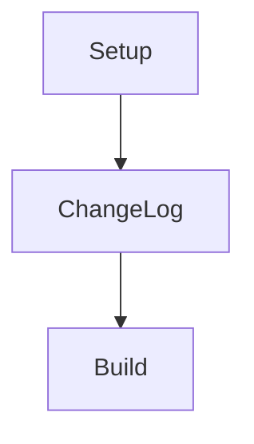
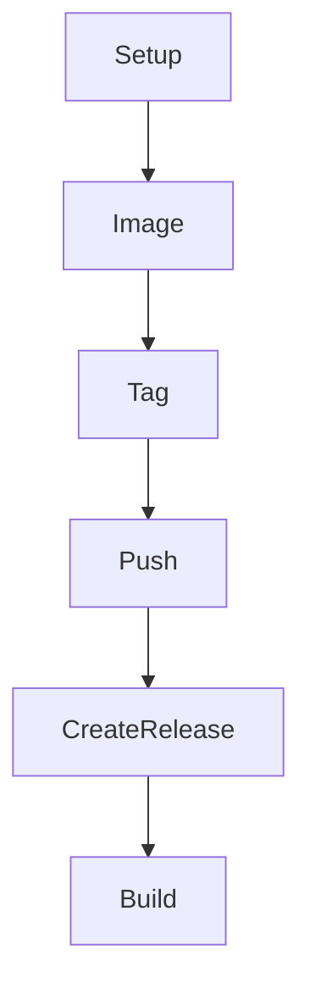
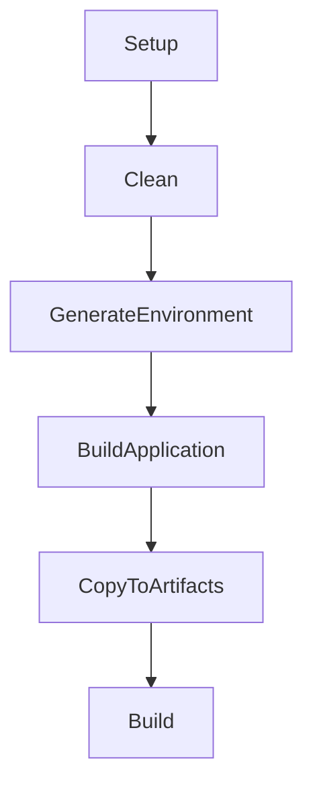

This page describes the main build targets available in the Forge system for Docker and Node.js projects.

---

## 🛠️ Forge (Generic) Targets

- 🏗️ **Build**: Runs the main build process for the selected project type (Docker, Node, etc.), depending on your command-line arguments.
- 📝 **ChangeLog**: Generates or updates the project changelog based on recent commits.

### 🗺️ Target Execution Order

This diagram shows the order in which the Forge (Generic) targets are executed:

---

## 🐳 Docker Targets

- 🏗️ **Build**: Builds the Docker image, orchestrating all Docker-related steps.
- 🚀 **CreateRelease**: Creates a GitHub release for the built Docker image (if enabled and configured).
- 📤 **Push**: Pushes the built Docker image(s) to the configured container registry.
- 🏷️ **Tag**: Tags the Docker image with the appropriate version and latest tags.
- 🖼️ **Image**: Runs the actual Docker build command to produce the image.

### 🗺️ Target Execution Order

This diagram shows the order in which the Docker build targets are executed:

---

## 🟩 Node Targets

- 🏗️ **Build**: Runs the full Node.js build pipeline, including environment generation, application build, and artifact copying.
- 📦 **CopyToArtifacts**: Copies the built Node.js application and related files to the artifacts directory.
- 🛠️ **BuildApplication**: Executes the Node.js build process (e.g., `npm run build`).
- 🌱 **GenerateEnvironment**: Generates the environment file from your mapping configuration, ensuring all required variables are set.
- 🧹 **Clean**: Cleans the artifacts directory and prepares the workspace for a fresh build.

### 🗺️ Target Execution Order

This diagram shows the order in which the Node.js build targets are executed:

