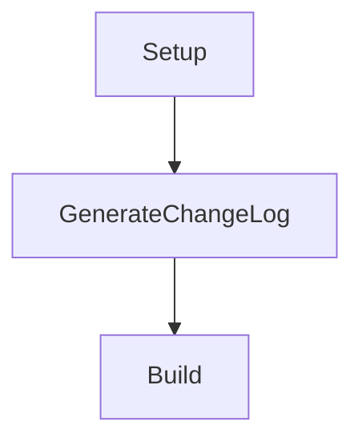
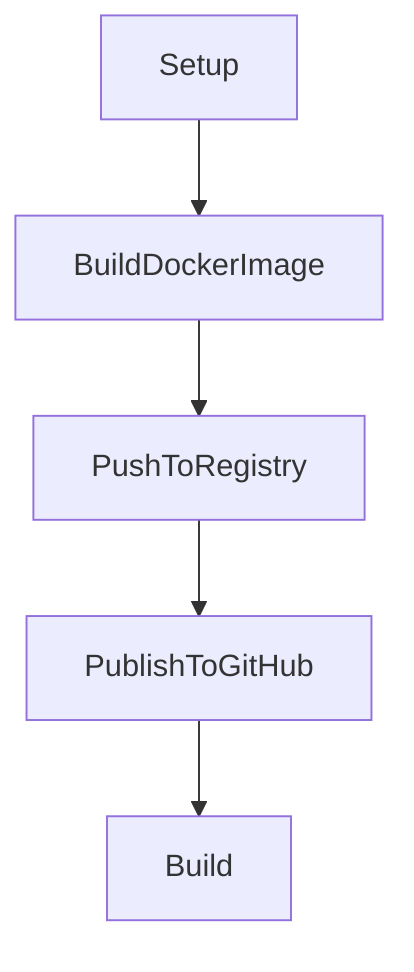
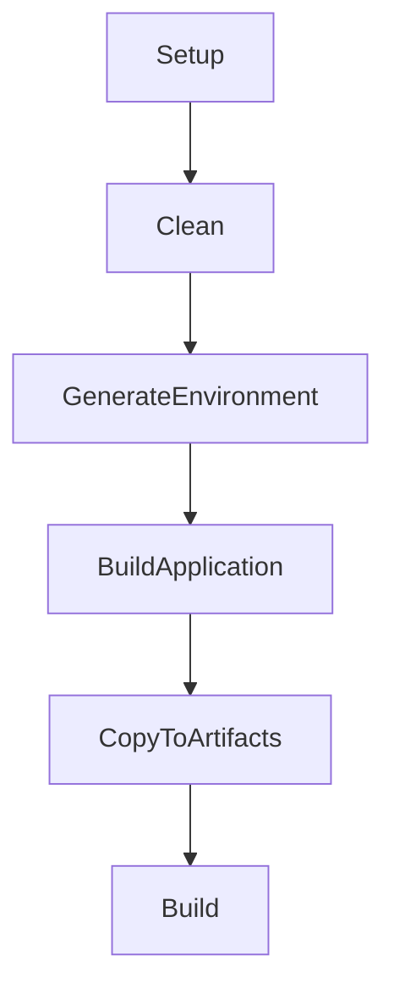
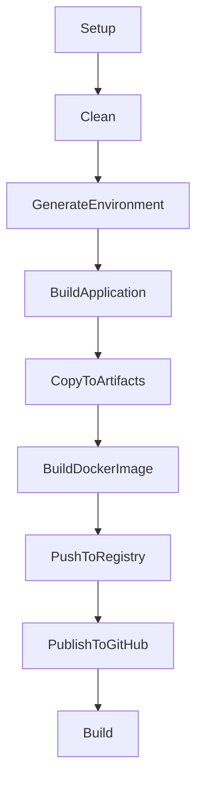

This page describes the main build targets available in the Forge system for Docker and Node.js projects.

---

## 🛠️ Forge (Changelog Generation) Targets

- 🏗️ **Build**: Completes the build process after changelog generation (depends on GenerateChangeLog).
- 📝 **GenerateChangeLog**: Generates formatted changelog from Git commit history and saves to CHANGELOG.md.
- ⚙️ **Setup**: Initializes parameters and environment configuration.

**Changelog Features**:

- Supports multiple sources: since last tag, complete history, or specific tag
- Uses customizable date formatting (default: `yyyy.MM.dd`)
- Automatically prepends new content to existing changelog files
- Groups commits by date in descending order (latest first)

### 🗺️ Forge Target Execution Order

This diagram shows the order in which the Forge (Changelog Generation) targets are executed:

---

## 🐳 Docker Targets

- 🏗️ **Build**: Builds the Docker image, orchestrating all Docker-related steps.
- 🚀 **PublishToGitHub**: Creates a GitHub release for the built Docker image (if enabled and configured).
- 📤 **PushToRegistry**: Pushes the built Docker image(s) to the configured container registry.
- 🖼️ **BuildDockerImage**: Runs the actual Docker build command to produce the image.

### 🗺️ Docker Target Execution Order

This diagram shows the order in which the Docker build targets are executed:

---

## 🟩 Node Targets

- 🏗️ **Build**: Runs the full Node.js build pipeline, including environment generation, application build, and artifact copying.
- 📦 **CopyToArtifacts**: Copies the built Node.js application and related files to the artifacts directory.
- 🛠️ **BuildApplication**: Executes the Node.js build process (e.g., `npm run build`).
- 🌱 **GenerateEnvironment**: Generates the environment file from your mapping configuration, ensuring all required variables are set.
- 🧹 **Clean**: Cleans the artifacts directory and prepares the workspace for a fresh build.

### 🗺️ Target Execution Order

This diagram shows the order in which the Node.js build targets are executed:

---

## 🟩🐳 NodeInDocker Targets

The NodeInDocker build combines Node.js application building with Docker image creation:

- 🏗️ **Build**: Executes the complete pipeline from Node.js build to Docker image push and GitHub release.
- 🚀 **PublishToGitHub**: Creates a GitHub release for the built Docker image (if enabled and configured).
- 📤 **PushToRegistry**: Pushes the built Docker image(s) to the configured container registry.
- 🖼️ **BuildDockerImage**: Builds the Docker image from the Node.js artifacts.
- 📦 **CopyToArtifacts**: Copies the built Node.js application to the artifacts directory.
- 🛠️ **BuildApplication**: Executes the Node.js build process.
- 🌱 **GenerateEnvironment**: Generates the environment file from your mapping configuration.
- 🧹 **Clean**: Cleans the artifacts directory and prepares the workspace for a fresh build.

### 🗺️ NodeInDocker Target Execution Order

This diagram shows the order in which the NodeInDocker build targets are executed:

