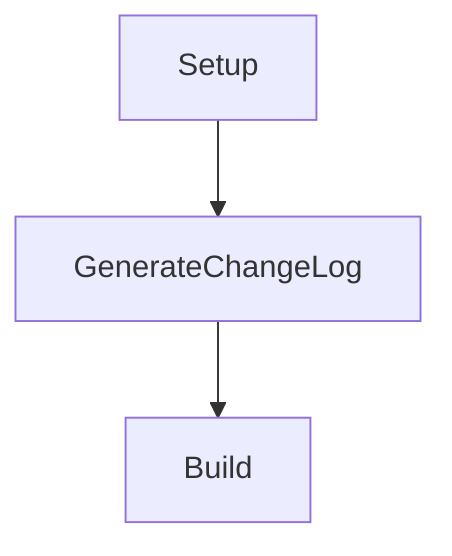
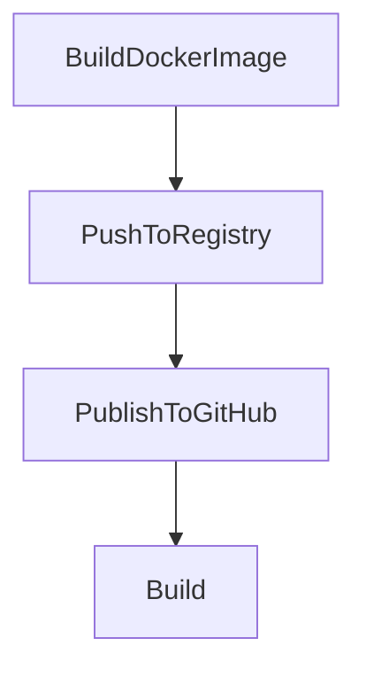
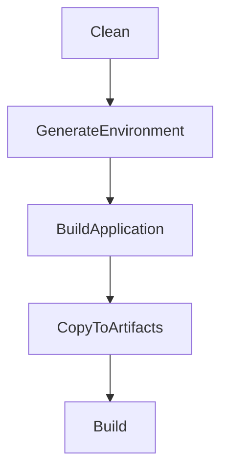
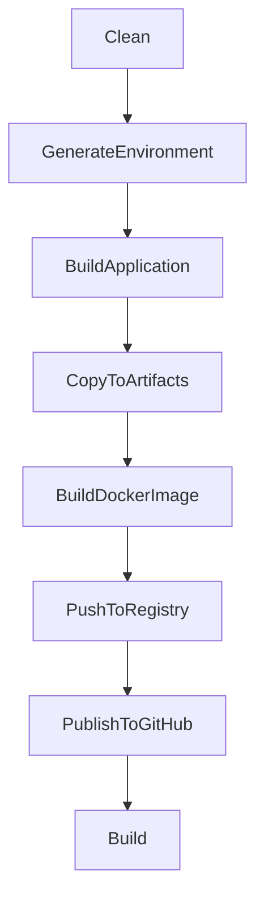

Each build type runs a fixed chain of targets. This page lists the targets of every type, the order they run in and
the conditions under which a target is skipped. `build node-template` is a PowerShell script, not a chain of targets,
so it is not listed here.

By default a build type runs its `Build` target, and a target runs after everything it depends on. To run one
target and the targets before it, pass `--target` after the build type:

```bash
build docker --target BuildDockerImage
```

## Forge

`build forge` generates the change log.

| Target | What it does |
|---|---|
| `Setup` | Checks that the `.build` directory exists and logs the parameters in use. |
| `GenerateChangeLog` | Writes the change log from the Git history to `CHANGELOG.md`. |
| `Build` | Finishes the build. Depends on `GenerateChangeLog`. |

The target writes `CHANGELOG.md` in the project root, puts the new entries before any existing content and
groups commits by date, latest first, with dates written as `yyyy.MM.dd`. The commits come from the change log
source: since the last tag, the complete history or since a named tag. See
[Change log source](./parameters.md#change-log-source).


```mermaid
flowchart TD
    Setup --> GenerateChangeLog --> Build
```

`Setup` is part of this chain only. The other build types do not run it, although `--target Setup` runs it on any of them.

## Docker

`build docker` builds an image from the project and, in CI, pushes it and publishes a release.

| Target | What it does | Skipped when |
|---|---|---|
| `BuildDockerImage` | Builds the image. When the project has no Dockerfile it copies a [template](./docker-templates.md). | Never. |
| `PushToRegistry` | Logs in to the registry and pushes the image tags. Fails with `RegistryToken is Not Set` when no token is set. | The build is local or a dry run, unless `--force-push true` is given. |
| `PublishToGitHub` | Creates the GitHub release, then the Git tag `v` followed by the version. | `--create-github-release` is not true, the build is local or a dry run (unless `--force-push true`), the repository has no HTTPS URL, or `RegistryToken` is empty. |
| `Build` | Finishes the build. Depends on `PublishToGitHub`. | Never. |


```mermaid
flowchart TD
    BuildDockerImage --> PushToRegistry --> PublishToGitHub --> Build
```

A skipped target does not fail the build. A build is local when it does not run on a CI server.

## Node

`build node` builds a Node.js application into the artifacts directory.

| Target | What it does |
|---|---|
| `Clean` | Deletes the artifacts directory if it exists and creates it again empty. |
| `GenerateEnvironment` | Writes the application environment file `.env` from `.build/.app.env.map`. Fails when a value in the map is missing. |
| `BuildApplication` | Runs the build scripts in `.build/.build.scripts`. Without that file it removes `node_modules`, then runs `<package manager> install` and `<package manager> run build:prod`. |
| `CopyToArtifacts` | Copies the files listed in `.build/.build.copy` to the artifacts directory. |
| `Build` | Finishes the build. Depends on `CopyToArtifacts`. |


```mermaid
flowchart TD
    Clean --> GenerateEnvironment --> BuildApplication --> CopyToArtifacts --> Build
```

## Node in Docker

`build node-in-docker` runs the Node build, then the Docker build with the same targets as above.

| Target | Same as |
|---|---|
| `Clean`, `GenerateEnvironment`, `BuildApplication`, `CopyToArtifacts` | [Node](#node) |
| `BuildDockerImage`, `PushToRegistry`, `PublishToGitHub` | [Docker](#docker) |
| `Build` | Finishes the build. Depends on `PublishToGitHub`. |


```mermaid
flowchart TD
    Clean --> GenerateEnvironment --> BuildApplication --> CopyToArtifacts --> BuildDockerImage --> PushToRegistry --> PublishToGitHub --> Build
```

This type always tags the image with both `latest` and the version. `build docker` adds the version tag only when
`--create-github-release` is true.

## Related pages

- [Build Types](./build-types.md) for the commands and the files each type reads.
- [Parameters](./parameters.md) for the flags that decide which targets are skipped.
- [Exit Codes](./exit-codes.md) for what a failed target returns.

Canonical contract (build command): [design/20-contract.md](https://github.com/The-Running-Dev/Docker-BuildAgent/blob/main/design/20-contract.md)
